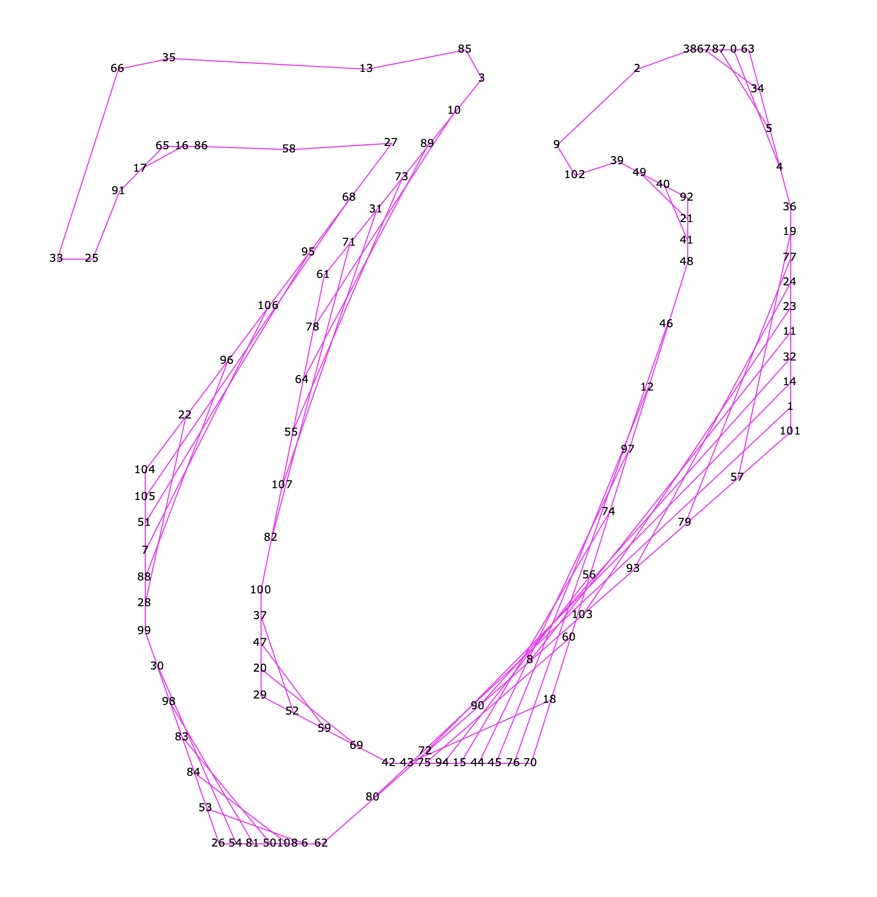
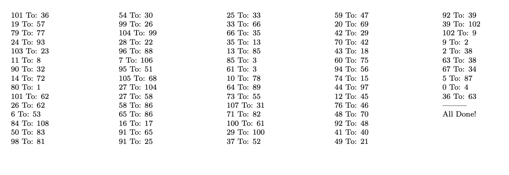
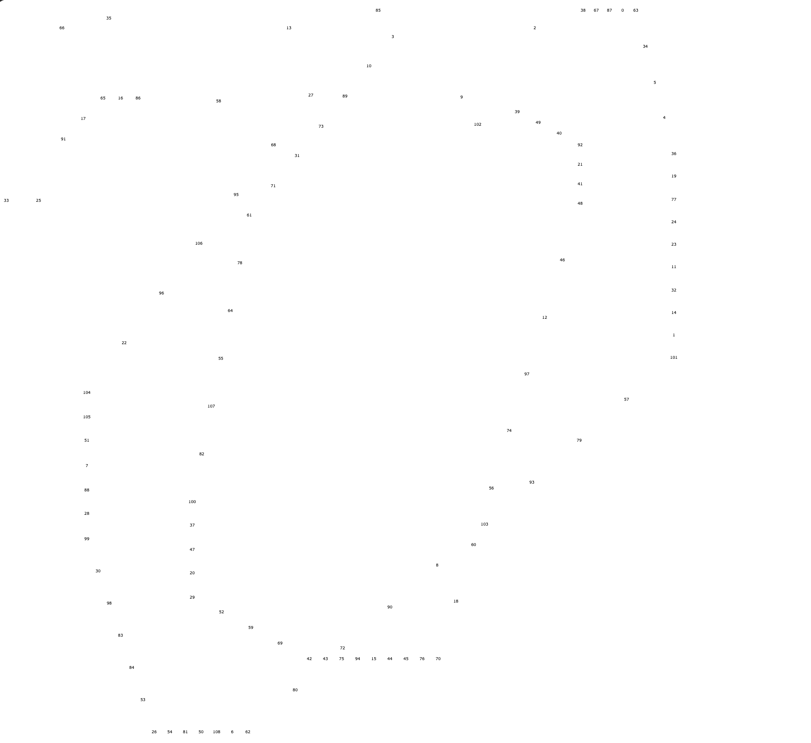

Done september 20th 2024, revised september 24th 2025

Generates curve-stitching or string art illustrations (potentially instructions)
for simple characters in fonts, using straight segments to immitate the beziers
of the font;  if the font beziers consists of very short or very straight or flat
beziers, this will not work well (it'll generate like only a line or two)

Personal experiment; no maintenance expected.

A random small project to generate curve-stitching illustrations
of fonts, using FontForge and tkinter, with ability to export
instructions.

Very early attempt at tkinter; on macOS run FontForge on the
Python script like this
```
/Applications/FontForge.app/Contents/Resources/opt/local/bin/fontforge -script stitch.py
```

after that paste the output it produces into draw.py.  If it's too thick
or too thin change the div parameter of ``convert_to_quadratic_and_generate_instructions``
to a smaller number, vice versa

draw.py can then be ran using regular Python, if it errors
you probably didn't paste in the instructions properly.  It can either
produce a visualization of strings with point numbers (use Enter to zoom in
and Backspace to zoom out) or produce the sheet with all the point numbers on it
in case you want to actually make string art for a font.

stitch.py generates table.tex which can be ran into pdflatex to produce so-called
string art instructions however sometimes you may need to swap steps or
use tape because of same starting and ending point.  We try to prevent
that but is not always successful.

test.ttf is a byproduct.


DO NOT RUN ON COMMERCIAL FONTS

This is to illustrate bezier curves so the output is dependant on the font
software -- and software is copyrightable.

Limitation of the heuristic is that large, flat curves can't really get
a lot of subdivisions -- and they aren't really supposed to be because
then the thickness of the lines will make the lines coincide together a lot
and be ugly.  So like don't expect to see the z swoop up and down of Palatino
beyond just a few straight lines.








